```js
---
config:
  layout: cose
---
```

|Layout|특징|
|---|---|
|`dagre`|**기본값**, 계층형 그래프에 적합|
|`elk`|**복잡한 그래프 자동 배치에 강함**|
|`tidy-tree`|트리 구조를 깔끔하게 정렬|
|`cose`|네트워크처럼 연결관계 중심으로 배치|
|`elk` 계열 옵션|방향·간격 등을 세밀하게 조정 가능|

## layout: dagre

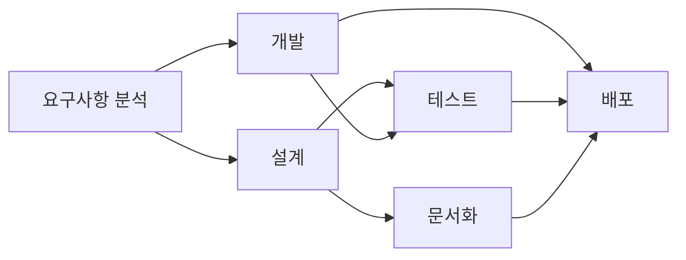

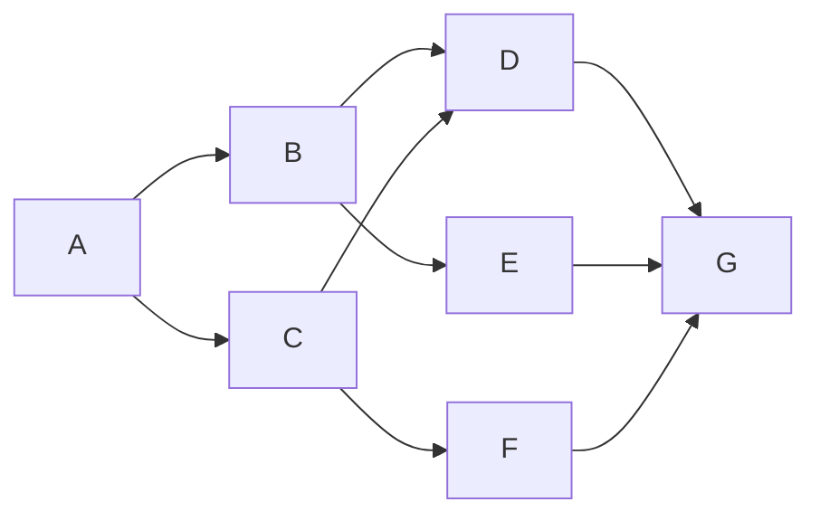

## layout: elk

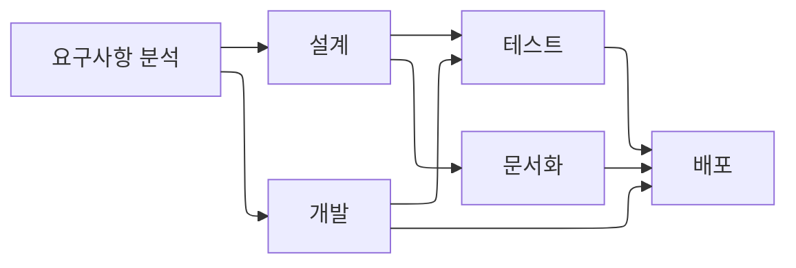

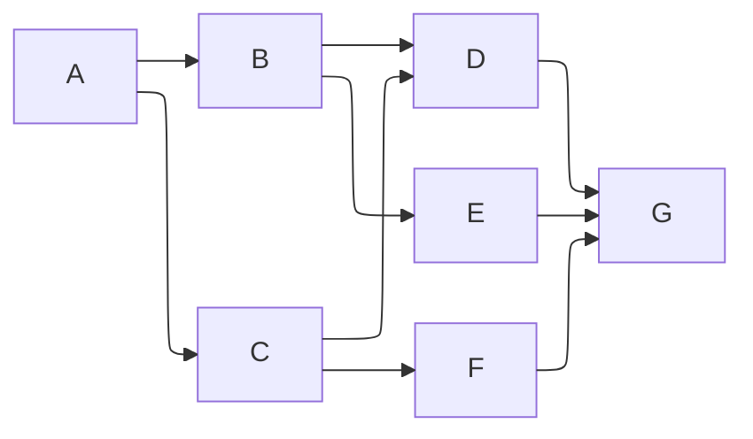

# chart 종류

## [[flowchart]]

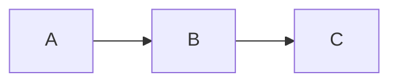

## sequenceDiagram

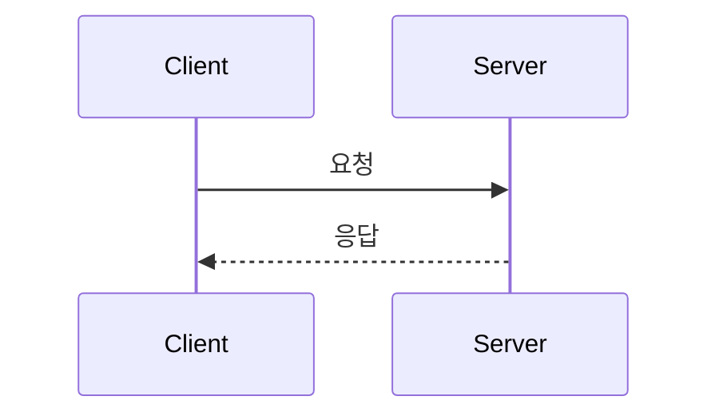

## classDiagram

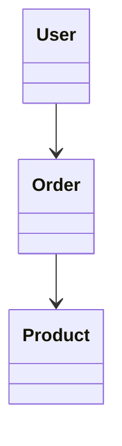

## erDiagram

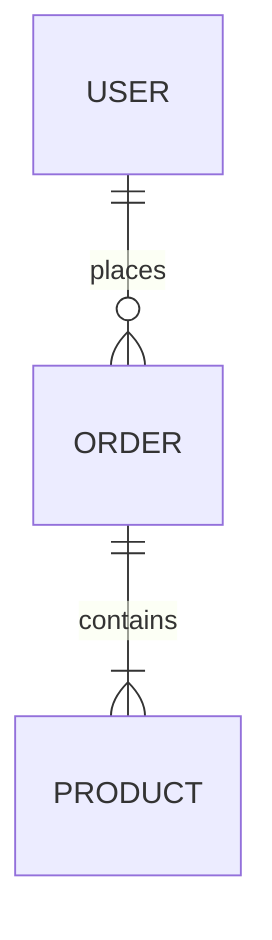

## stateDiagram-v2

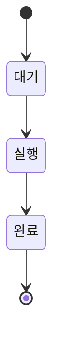

## journey

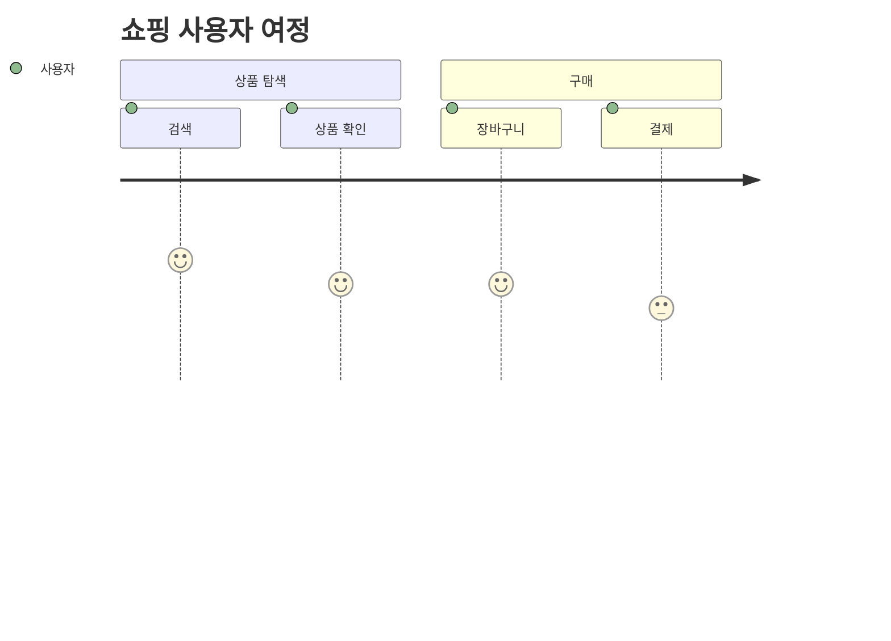

## gantt

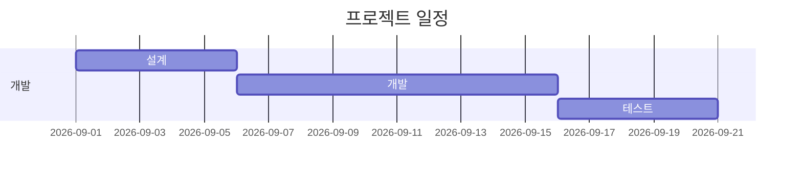

## pie

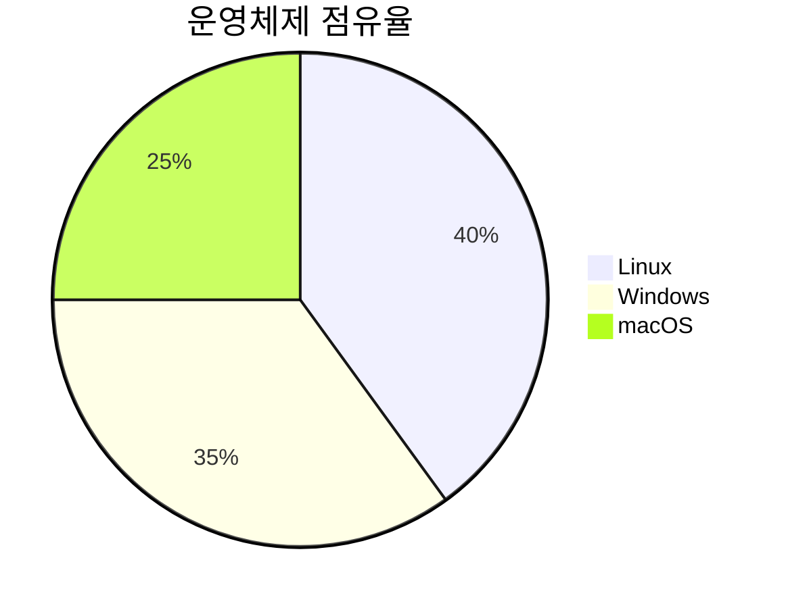

## gitGraph

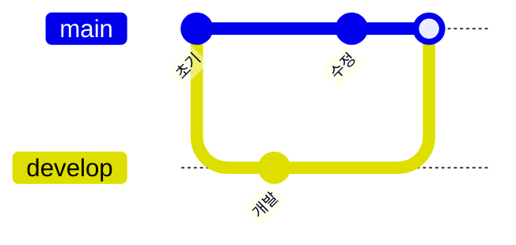

## timeline

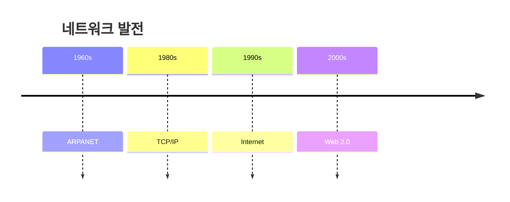

## quadrantChart

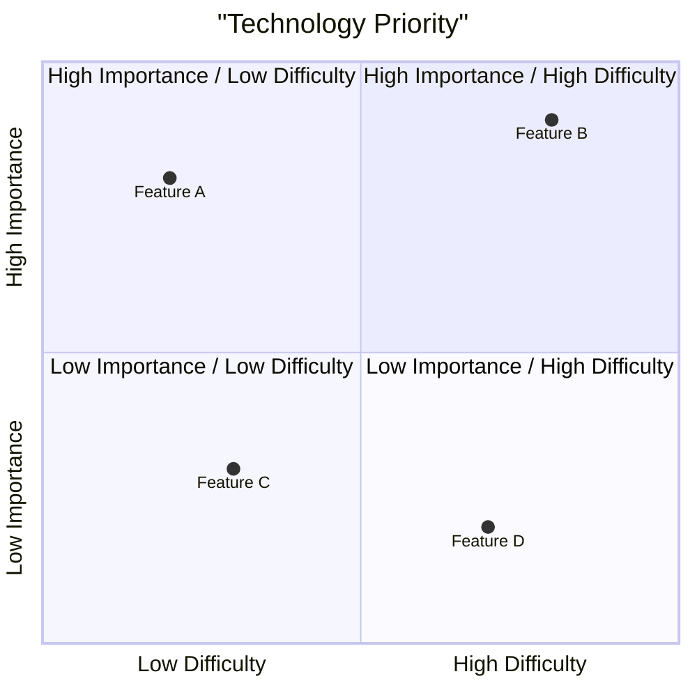

## requirementDiagram

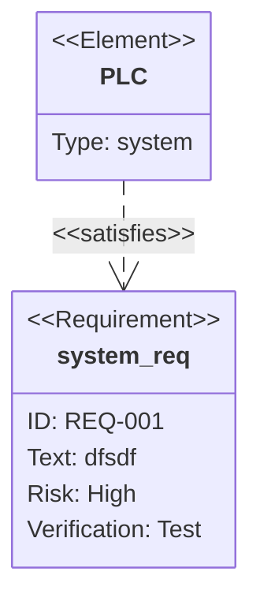

## C4Context

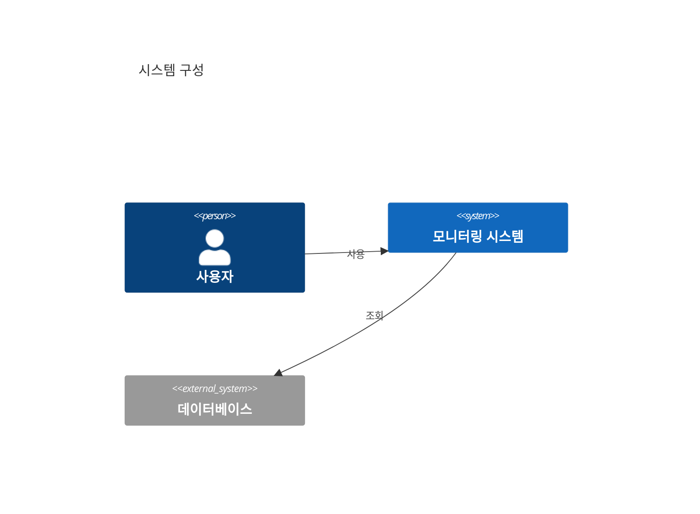

## sankey-beta


## xychart-beta

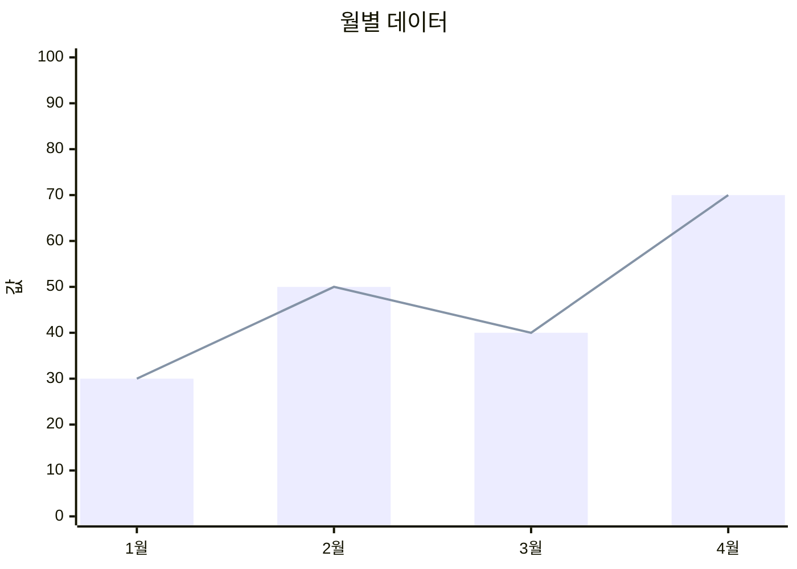

## block-beta

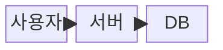

## architecture-betaㅁ

```mermaid
architecture-beta
    group api(cloud)[API]

    service server(server)[Server] in api
    service db(database)[Database]

    server:R --> L:db
```

```mermaid
treeView
			root/
			├── src/
			│   ├── components/
			│   │   ├── Button.tsx
			│   │   └── Modal.tsx
			│   └── App.tsx
			├── package.json
			└── README.md
```

# subgraph

```mermaid
graph TD
 subgraph 그룹이름 [표시할 그룹 제목]
	 direction LR
        A --> B
    end
  Mermaid --> Diagram
```